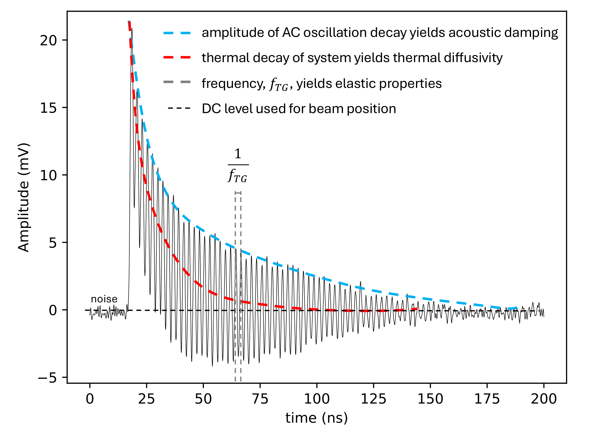
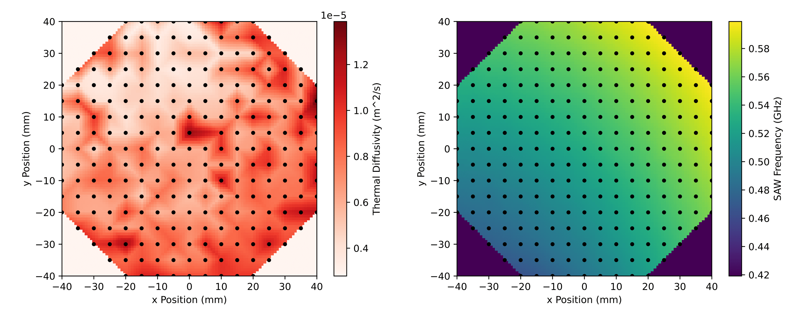

# Automated Transient Grating Spectroscopy (TGS) Mapping and Signal Control  
### Colin Weaver • Myles Stapelberg • Michael P. Short • Angus Wylie • Elena Botica Artalejo  
**Department of Nuclear Science and Engineering, MIT**  
*Dated: 02 February 2023*

---

## Overview

This repository contains supporting material and code associated with the paper:

**“Automated Transient Grating Spectroscopy Mapping and Signal Control for Large Samples.”**

The work presents a fully automated 3-axis TGS mapping system capable of:
- Mapping **large material surfaces** with minimal human intervention  
- Maintaining **high signal quality** using real-time signal-strength-based control  
- Operating on samples with **substantial surface roughness**  
- Producing spatial heatmaps of **thermal diffusivity**, **SAW frequency**, and **acoustic damping**

This system dramatically reduces mapping time, enables high-throughput TGS characterization, and provides a scalable path toward automated material property databases.

---

## Research Summary

Transient grating spectroscopy (TGS) is a **non-destructive** technique for measuring:
- Thermal diffusivity  
- Surface acoustic wave (SAW) frequency  
- Acoustic damping  
- Other thermo-mechanical properties  

A key challenge with TGS is the extremely tight **20 μm focal tolerance**, which historically required:
- Manual stage adjustments  
- Constant operator supervision  
- Poor repeatability over large areas  

This work introduces:
- A **3-axis Aerotech motion system** (0.75–1.5 μm accuracy)
- A **control algorithm** maximizing the peak TGS signal in real time  
- A **vacuum-integrated wafer holder** for thermal measurements  
- A full autonomous mapping pipeline validated on:
  - **Pure tungsten calibration samples**
  - **Cu–Cr–Al gradient PVD composition wafers**

---

## Key Results

### Example Raw TGS Signal + Fit  

  

---

### Thermal Diffusivity Map (40 mm × 40 mm)

  

---